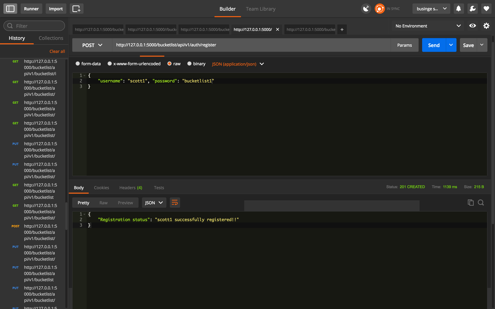
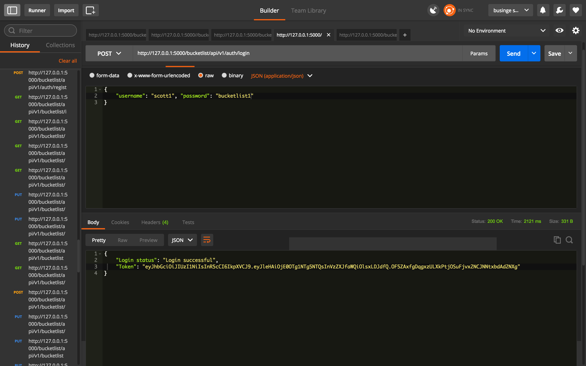
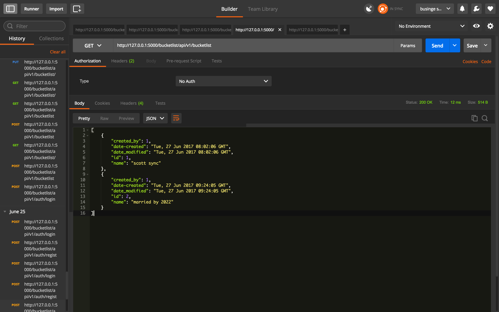
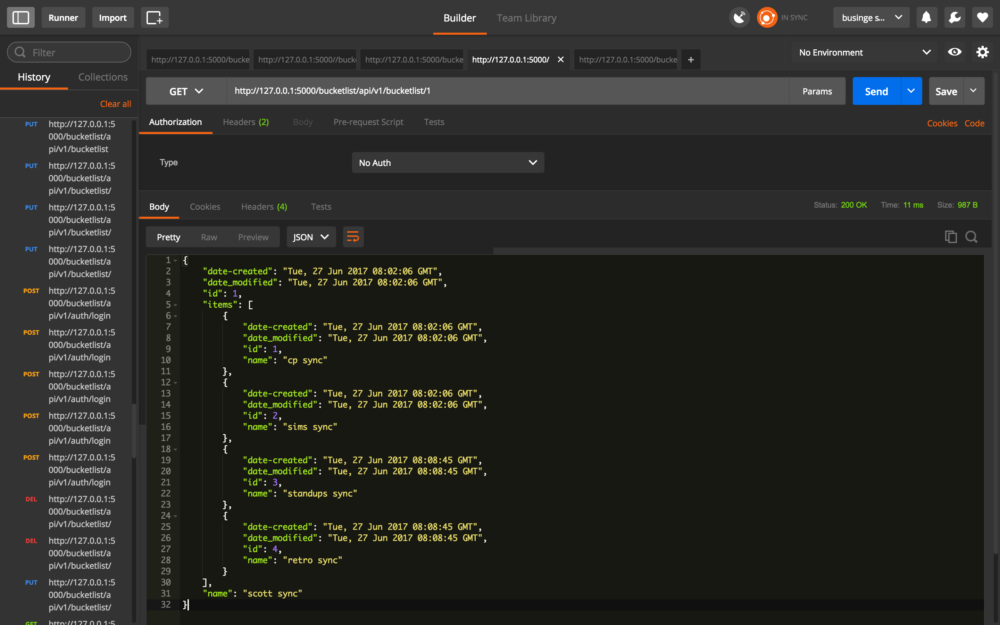
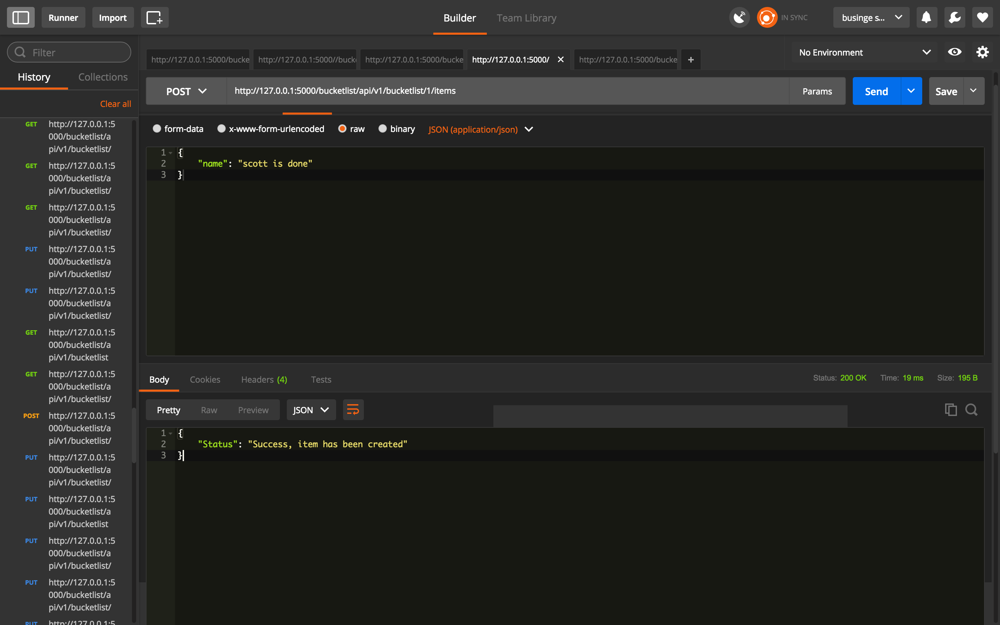
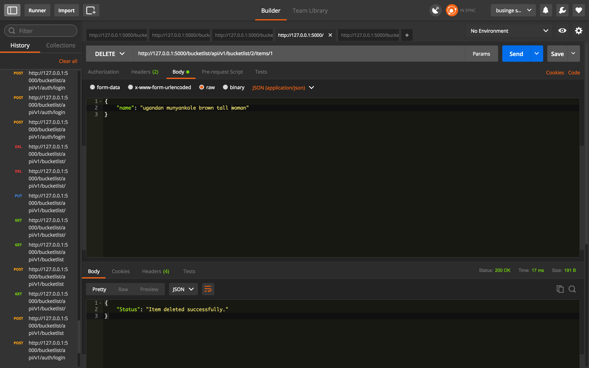

[]()
[](https://coveralls.io/github/scott45/checkpoint2-bucketlist?branch=develop)
[](https://www.python.org/dev/peps/pep-0008/)
[](https://opensource.org/licenses/MIT)

# Liste des seaux : A Bucketlist API


## Introduction;
A Bucket List is a list of things that one has not done but wishes to accomplish before their demise. Liste des seauxis is the french word for bucketlist. It enables CRUD
functionality (Create, Read, Update, Delete) operations on the bucket list.

>A project done in fulfillment of the second checkpoint of the Andela training program.

>The API is hosted live on Amazon Web Services (AWS); http://35.160.201.56:4444/

>The API is hosted live on Heroku; https://herokubucketlist.herokuapp.com/

>Any other operation just requires to add on bucketlist endpoints. 
To have a great expereince using the API, I recommend you use API consuming platforms like Postman or hurl (https://www.hurl.it/) which works online

>The API live documentation can be found here; https://scott45.github.io/slate/#introduction-to-bucketlist-api

# Project description

Brief highlights about the following concepts is necessary:

 >API

 >REST

 >JSON

**API**

An **API**, acronym for Application Programming Interface, provides a blueprint for how software programs interacts with each other.

**REST**

REST is an acronym that stands for **RE**presentational **S**tate **T**ransfer and has become the de-facto way of building API's and thus API's using this standard are known as RESTFul API's. The five main principles the implementation of REST and RESTFulness are:

>Everything is a resource.

>Every resource has a unique identifier.

>Use simple and uniform interfaces.

>Communication is done by representation.

>Aim to be Stateless.

**JSON**

Yet another acronym, JSON which stands for **J**avascript **O**bject **N**otation, is a light-weight format that facilitates interchange of data between different systems or, case in point, software. It is intended to be universal and thus allows consumption of data by any program regardless of the programming language it is written in. Sample JSON data would be as follows:

```
{
"name":"bucketlist",
"description":"A Flask Bucketlist API",
"created_by":"scotty-b",
}

```

## Installation
 
Clone the GitHub repo with the following command:
 
http:
>`$ git clone https://github.com/scott45/checkpoint2-bucketlist.git`

cd into the folder and install a [virtual environment](https://virtualenv.pypa.io/en/stable/)

`$ virtualenv venv`

Activate the virtual environment

`$ venv/bin/activate`

Install all app requirements

`$ pip install -r requirements.txt`
Create the database and run migrations

`$ createdb bucketlist_db`

`$ createdb testing_db`

`$ python manage.py db init`

`$ python manage.py db migrate`

`$ python manage.py db upgrade`

All done! Now, start your server by running `python manage.py runserver`. You could use a GUI platform like [postman](https://www.getpostman.com/) to make requests to and fro the api.
### Endpoints

Here is a list of all the endpoints in bucketlist app.

Endpoint | Functionality| Access
------------ | ------------- | ------------- 
POST bucketlist/app/v1/auth/login |Logs a user in | PUBLIC
POST bucketlist/app/v1/auth/register | Registers a user | PUBLIC
POST bucketlist/app/v1/bucketlists/ | Creates a new bucket list | PRIVATE
GET bucketlist/app/v1/bucketlists/ | Lists all created bucket lists | PRIVATE
GET bucketlist/app/v1/bucketlists/id | Gets a single bucket list with the suppled id | PRIVATE
PUT bucketlist/app/v1/bucketlists/id | Updates bucket list with the suppled id | PRIVATE
DELETE bucketlist/app/v1/bucketlists/id | Deletes bucket list with the suppled id | PRIVATE
POST bucketlist/app/v1/bucketlists/id/items/ | Creates a new item in bucket list | PRIVATE
PUT bucketlist/app/v1/bucketlists/id/items/item_id | Updates a bucket list item | PRIVATE
DELETE bucketlist/app/v1/bucketlists/id/items/item_id | Deletes an item in a bucket list | PRIVATE

### Screenshots

>Register


>Login


>add bucket


>list all buckets


>get single bucket


>add item


delete


### Searching (querying results)

Functionality to search bucketlists using the parameter `q` in the GET request is enabled. 
Example:

`GET http://localhost:/bucketlists?q=<whatever>`

This request will return all bucketlists with `whatever` in their name

### Sample GET response
After a successful resgistration and login, you will receive an athentication token. Pass this token in your request header.
Below is a sample of a GET request for bucketlist

### Runing Tests
The application tests are based on python’s unit testing framework unittest.
To run tests with nose, run `nosetests`

## Credits

1. [Businge Scott](https://github.com/scott45)

2. The amazing [Andela](https://www.andela.com) community.

## License

### The MIT License (MIT)

Copyright (c) 2017 [BUSINGE SCOTT [ANDELA]]

> Permission is hereby granted, free of charge, to any person obtaining a copy
> of this software and associated documentation files (the "Software"), to deal
> in the Software without restriction, including without limitation the rights
> to use, copy, modify, merge, publish, distribute, sublicense, and/or sell
> copies of the Software, and to permit persons to whom the Software is
> furnished to do so, subject to the following conditions:
>
> The above copyright notice and this permission notice shall be included in
> all copies or substantial portions of the Software.
>
> THE SOFTWARE IS PROVIDED "AS IS", WITHOUT WARRANTY OF ANY KIND, EXPRESS OR
> IMPLIED, INCLUDING BUT NOT LIMITED TO THE WARRANTIES OF MERCHANTABILITY,
> FITNESS FOR A PARTICULAR PURPOSE AND NONINFRINGEMENT. IN NO EVENT SHALL THE
> AUTHORS OR COPYRIGHT HOLDERS BE LIABLE FOR ANY CLAIM, DAMAGES OR OTHER
> LIABILITY, WHETHER IN AN ACTION OF CONTRACT, TORT OR OTHERWISE, ARISING FROM,
> OUT OF OR IN CONNECTION WITH THE SOFTWARE OR THE USE OR OTHER DEALINGS IN
> THE SOFTWARE.
